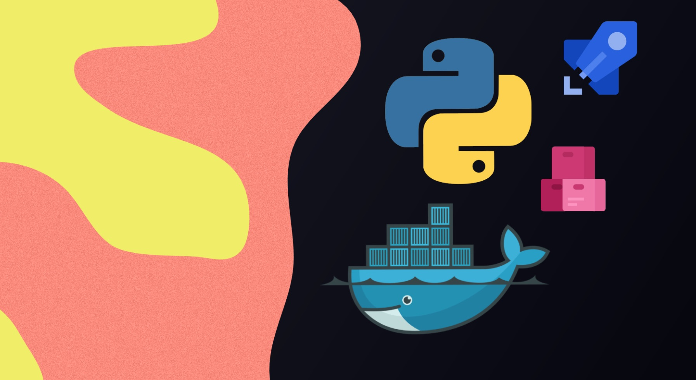

# Building Docker images using DevOps Pipelines with private DevOps Artifactory PyPi feed



Building CI/CD environments with Azure DevOps Pipelines is a delightful experience. Still, since you are reading this article, there is quite a significant likelihood that you were, same as me, trying to install packages from your private DevOps Artifcatory for your Docker image. And there, things start to get a little bit more complicated.

## Problem

- We want to install Python packages from our private DevOps Artifact PyPi repo during the Docker image build task.
- We wish to use the standard Python package manager, which is `pip`, and we also want minimal modifications to our Dockerfile.
- The Dockerfile needs to be reusable, and we don't want to bloat it with any vendor-specific authentication related code.

How to that?

## Authentication to Azure DevOps Artifactory

Let's start with authentication to DevOps Artifactory. DevOps Pipelines come with various handy tasks, and one of them is named [PipAuthenticate](https://docs.microsoft.com/en-us/azure/devops/pipelines/tasks/package/pip-authenticate?view=azure-devops). It's a very simple tool, that takes care of authentication to DevOps Artifacts Python package feeds.

```yaml
- task: PipAuthenticate@1
  inputs:
    artifactFeeds: my-private-pypi
    onlyAddExtraIndex: true
```

All you need to do is to add this task to your pipeline and... that's it. You can run now

```bash
pip install my-secret-package
```

and enjoy all the secret packages you store in your DevOps Artifactory. Everything will work fine on the build agent machine, but things start to be a little bit more complicated when we want to enjoy the same freedom of installing private packages inside our Docker build. Docker will not be aware of any authentication context by default. 

## Looking under the hood - PipAuthenticate

So how this magic works? Luckily for us, all the DevOps Pipelines tasks are open-sourced. Looking at [pipauthenticatemain.ts](https://github.com/microsoft/azure-pipelines-tasks/blob/master/Tasks/PipAuthenticateV1/pipauthenticatemain.ts#L63) we will quickly realize that after the authentication is done, the task is updating the `$PIP_EXTRA_INDEX_URL` environment variable on the agent machine. This variable is then used by pip to authenticate to our artifactory. 

## Putting it all together

The idea is simple. We want to get the `$PIP_EXTRA_INDEX_URL` variable from our build agent host and pass it to our Docker build context.

### Dockerfile

```docker
FROM python:3.7-slim

ARG PIP_EXTRA_URL

COPY requirements.txt /tmp/
RUN pip install -r /tmp/requirements.txt --extra-index-url $PIP_EXTRA_URL

RUN mkdir /app
COPY . /app

WORKDIR /app

CMD ["python", "main.py"]
```

Looking at the Dockerfile, you will notice `PIP_EXTRA_URL` argument we will require during the build phase. The argument is then passed to our `pip` command as "--extra-index-url"


### Getting the artifactory URL

The next step is to get the artifactory URL with an authentication token. We will use the aforementioned `PipAuthenticate` task to do it.

```yaml
    - task: PipAuthenticate@1
      displayName: Auth to Artifactory
      inputs:
        artifactFeeds: my-private-pypi
        onlyAddExtraIndex: true

    - bash: |
        echo "##vso[task.setvariable variable=artifactoryUrl;]$PIP_EXTRA_INDEX_URL"
      displayName: Export Artifactory URL
```
Two things to note here: 

- We are explicitly saying, we want our artifactory added as an extra index by specifying: `onlyAddExtraIndex: true`.
- We are exporting the `PIP_EXTRA_INDEX_URL` to a variable called `artifactoryUrl`. We will use this variable in the next step.

### Building and publishing our Docker images

The final step is to start the Docker build task:
```yaml
    - task: Docker@2
      displayName: Build an image
      inputs:
        command: build
        repository: $(imageRepository)
        containerRegistry: $(dockerRegistryServiceConnection)
        arguments: --build-arg PIP_EXTRA_URL="$(artifactoryUrl)"
        tags: |
          $(tag)
```
Here, we are finally passing `artifactoryUrl` to our Docker build. At this moment, the only thing left is to push our image to the container registry.

```yaml
    - task: Docker@2
      displayName: Push the image to container registry
      inputs:
        command: push
        repository: $(imageRepository)
        containerRegistry: $(dockerRegistryServiceConnection)
        tags: |
          $(tag)
```


## Final pipeline code

Once we are done, our pipeline code will look more or less like this:

```yaml 

trigger:
- master

resources:
- repo: self

variables:
  dockerRegistryServiceConnection: '00000000-0000-0000-0000-000000000000'
  imageRepository: 'my-service'
  containerRegistry: 'myregistry.azurecr.io'
  dockerfilePath: 'Dockerfile'
  tag: '$(Build.BuildId)'
  artifactFeed: my-private-pypi

  vmImageName: 'ubuntu-latest'

stages:
- stage: Build
  displayName: Build and push stage
  jobs:  
  - job: Build
    displayName: Build
    pool:
      vmImage: $(vmImageName)
    steps:
    - task: PipAuthenticate@1
      displayName: Auth to Artifactory
      inputs:
        artifactFeeds: $(artifactFeed)
        onlyAddExtraIndex: true

    - bash: |
        echo "##vso[task.setvariable variable=artifactoryUrl;]$PIP_EXTRA_INDEX_URL"
      displayName: Export Artifactory URL

    - task: Docker@2
      displayName: Build an image
      inputs:
        command: build
        repository: $(imageRepository)
        containerRegistry: $(dockerRegistryServiceConnection)
        arguments: --build-arg PIP_EXTRA_URL="$(artifactoryUrl)"
        tags: |
          $(tag)

    - task: Docker@2
      displayName: Push the image to container registry
      inputs:
        command: push
        repository: $(imageRepository)
        containerRegistry: $(dockerRegistryServiceConnection)
        tags: |
          $(tag)
```

## Summary

I hope, after reading this article, you are ready to simplify your existing Python CI/CD pipelines. You can find the repository with [the example code at my Github](https://github.com/mpuhacz/building_docker_images_using_dev_ops_pipelines_with_private_dev_ops_artifactory_py_pi_feed). DevOps Pipelines is already a powerful tool, but still, it would be great to see a fully automated Docker image build flow with Artifact authentication as an automated task. I'm hoping the DevOps team has it somewhere on their TODO list.

If you have any questions, let me know here or on [my Twitter](https://twitter.com/marcinph).
